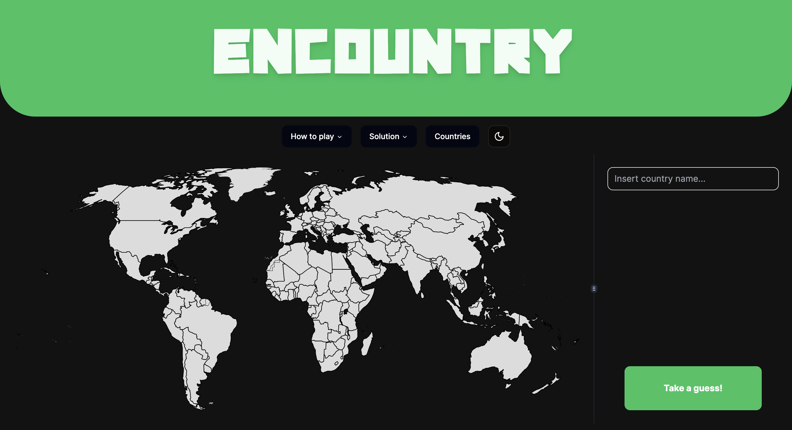
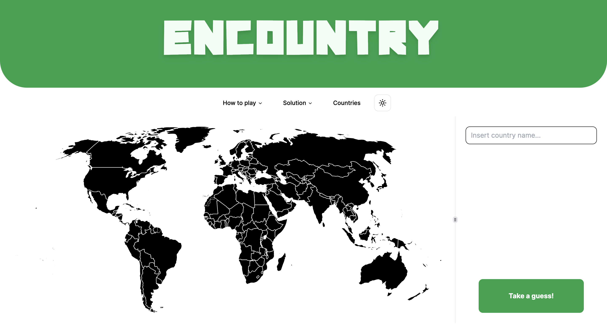
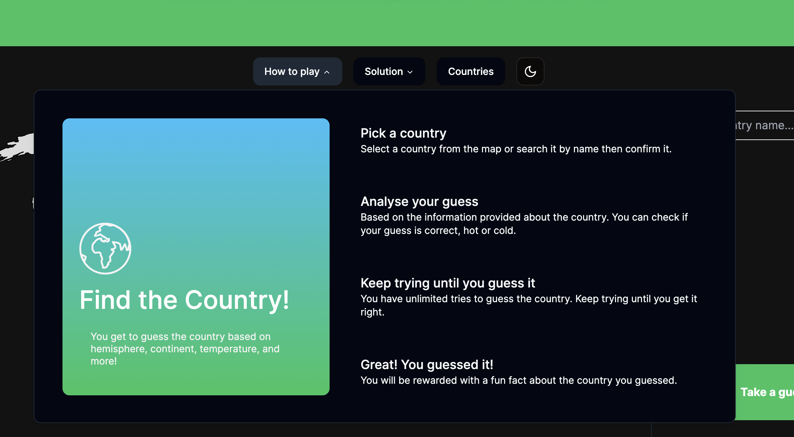
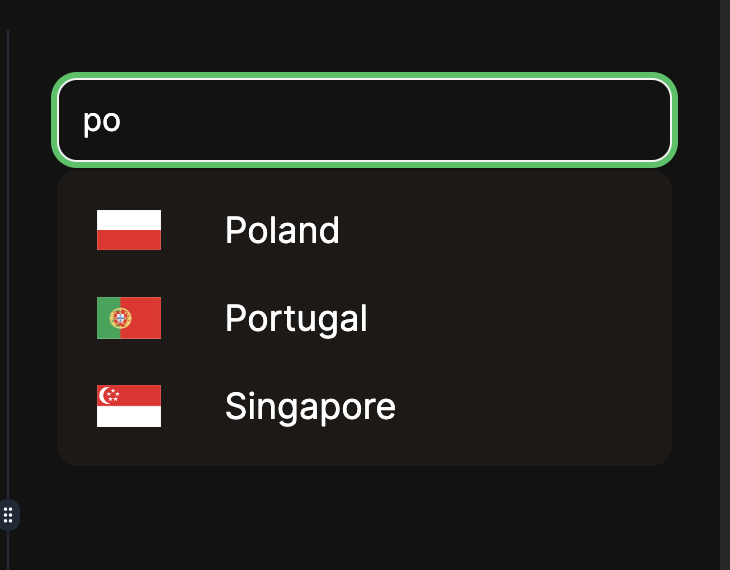
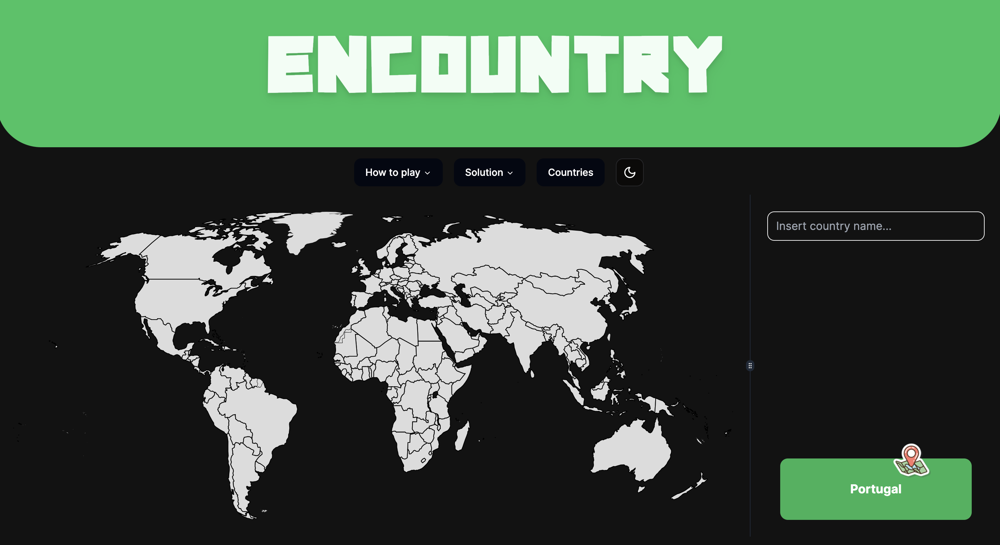
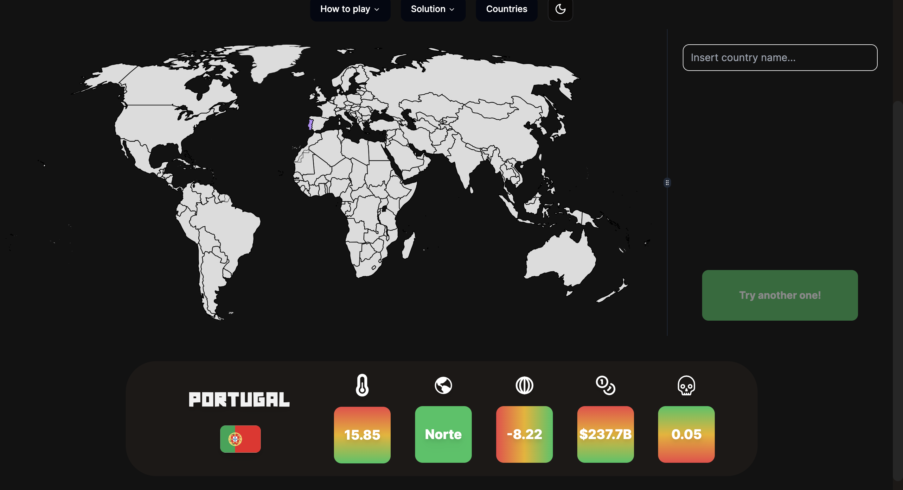
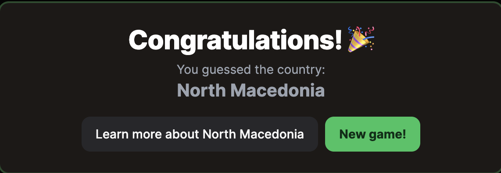
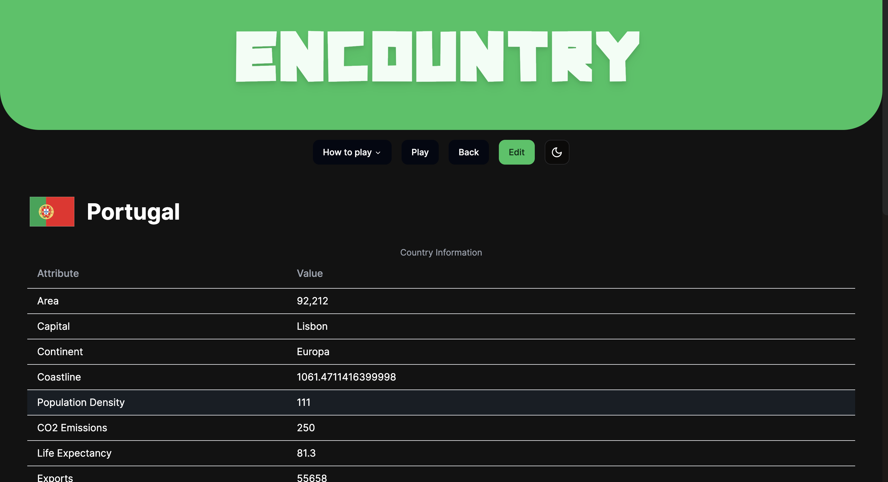
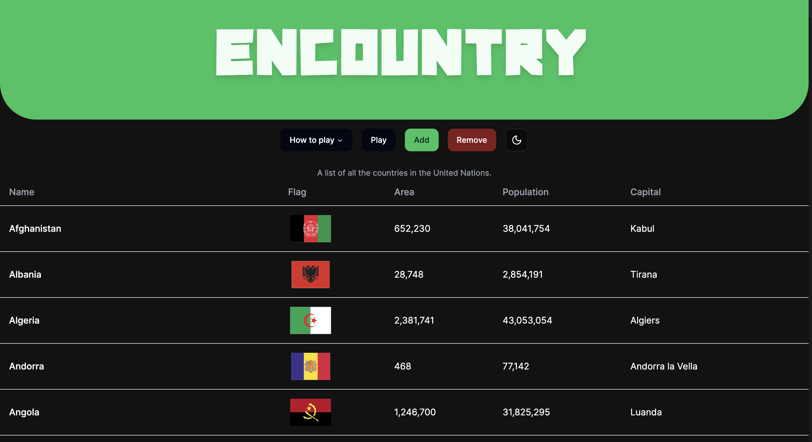

# Encountry

#### Realizador por:
| Nome | Número             |
| -------- | ------- |
| Francisca Barros | PG53816 |
| Rafael Correia | PG54162 |
| Robert Szabo | PG54194 |


## Índice

- [Encountry](#encountry)
      - [Realizado por:](#realizado-por)
  - [Índice](#índice)
  - [Introdução](#introdução)
  - [Ontologia](#ontologia)
  - [Front-end](#front-end)
    - [Página inicial](#página-inicial)
    - [Página do país](#página-do-país)
    - [Página dos países](#página-dos-países)
  - [Back-end](#back-end)
  - [Execução](#execução)
  - [Conclusão](#conclusão)

## Introdução
Para o trabalho de RPCW optámos por fazer um tema livre, pois acreditamos que isso nos permitiria ter um produto final mais interessante e mais aperfeiçoado, já que seria algo que nos interessaria mais.

Para este projeto tivemos inspiração em múltiplos outros jogos, como o Geoguessr, um jogo em que é apresentada uma imagem retirada do google maps e o objetivo é adivinhar o local e jogos como Wordle, em que o objetivo é adivinhar, neste caso uma palavra, a partir de pistas dadas a cada tentativa.

Com isto, decidimos fazer um jogo cujo o objetivo é adivinhar um país consoante pistas como o GDP e a população.

Antes de iniciarmos o desenvolvimento do projeto, fizemos alguma pesquisa com o objetivo de perceber se já existia algo semelhante e deparamo-nos com um jogo com uma ideia semelhante, o countryle. No entanto, como achamos que podíamos fazer um melhor produto, decidimos atacar este tema.

No countryle, nós vimos que eles só tinham 5 temas que nunca mudavam: Hemisfério, Continente, Temperatura Média, População e Coordenadas Geográficas. Nós achamos que só com estas opções o jogo ficaria aborrecido, por isso decidimos criar uma ontologia com informações variadas de todos os países do mundo para melhorar a experiência do jogo. 

## Ontologia

Para a ontologia, tivemos de delimitar o que consideramos que é um país. Baseamos a nossa definição no que as Nações Unidas consideram um país. Esta decisão foi importante e difícil, porque não há um consenso na definição de país. No final, consideramos 195 países, ao usar a definição das Nações Unidas, isto habilitou-nos a retirar muitos "países" que não têm muitos dados disponíveis, como províncias Francesas e Inglesas.

A ontologia neste momento é muito básica, mas com possibilidade para expandir no futuro, por exemplo: acrescentar cidades também e não só países. Para a entrega final a ontologia só possui uma classe: País e essa classe possui os seguintes atributos:
- **nome** : cada pais pode ter associado mais de um nome, visto que existem várias designações (para mais tarde ser possível procurar por qualquer uma delas)
- **longitude**
- **receita_imposto** : % de imposto no país, ex.: 22.80%
- **taxa_de_natalidade** : relação entre os nascimentos num ano e o número total da população.
- **latitude**
- **temperatura_media**
- **hemisferio**
- **capital**
- **taxa_de_mortalidade** 
- **taxa_fertilidade** : número médio de filhos que uma mulher tem ao longo da vida
- **exportacoes**
- **area** : area de um país em Km^2
- **emissoes_co2** : quantos milhões de toneladas de CO2 um país emite por toneladas por capita
- **costa** : costa por area do país
- **telefones_por_1000** 
- **moeda** : a moeda que é usada no país
- **taxa_desemprego** : % de desemprego num país
- **importacoes**
- **lado_em_que_conduz**
- **migracao_liquida**
- **espetativa_de_vida**
- **medicos_por_mil**
- **gdp** : valor monetário total de todos os bens e serviços produzidos de um país num ano. 
- **literacia** : % de literacia num país
- **mortalidade_infantil**
- **densidade_populacional**
- **populacao**
- **racio_sexos** : quantos homens existem para 100 mulheres
- **flag** : link para uma imagem da bandeira do país
- **continente**


Para obter a informação necessária para ontologia, extraímos informações de múltiplos sítios.

Inicialmente procurámos datasets sobre o mundo e deparamos por alguns. Decidimos por usar os seguintes datasets:

- [Countries of the world - bnokoro](https://github.com/bnokoro/Data-Science/blob/master/countries%20of%20the%20world.csv)
- [Countries of the World 2023 - nelgiriyewithana](https://www.kaggle.com/datasets/nelgiriyewithana/countries-of-the-world-2023)
- [undata country profiles - sudalairajkumar](https://www.kaggle.com/datasets/sudalairajkumar/undata-country-profiles)
- [Countries of the World - fernandol](https://www.kaggle.com/datasets/fernandol/countries-of-the-world)

De seguida, usámos a dbpedia para completar alguns dados que ainda estavam incompletos (moeda,capital,lado em que conduz,latitude e longitude). Para ir buscar estes dados foi usada esta query:

```sql
select distinct ?pais (SAMPLE(?capital) AS ?cap) ?conduz ?moeda (SAMPLE(?latitude) AS ?lat) (SAMPLE(?longitude) AS ?long) where {
?country a dbo:Country;
rdfs:label ?pais.
{
?country dbo:capital ?capitalURI.
?capitalURI rdfs:label ?capital.
filter(lang(?capital)="en").
}
UNION
{
?country dbp:capital ?capitalURI.
?capitalURI rdfs:label ?capital.
filter(lang(?capital)="en").
}
UNION
{
?country dbp:capital ?capital.
filter(lang(?capital)="en").
}
?country geo:lat ?latitude.
?country geo:long ?longitude.
optional{ ?country dbp:drivesOn ?conduz.}
optional{
?country dbo:currency ?moedaURI.
?moedaURI rdfs:label ?moeda.
filter(lang(?moeda)="en").
}
filter(lang(?pais)="en").

} 
```

Por fim, usamos webscraping para certas informações, como por exemplo: para ter as bandeiras dos países, usámos webscraping nesta [página](https://www.worldometers.info/geography/flags-of-the-world/) e para ter as temperaturas médias usámos esta [página](https://en.wikipedia.org/wiki/List_of_countries_by_average_yearly_temperature) e por fim para obter os continentes obtemos a informação [aqui](https://simple.wikipedia.org/wiki/List_of_countries_by_continents).

Infelizmente, houve sempre certas informações que escapavam às nossas scripts que tiveram de ser adicionadas manualmente, através de alguma pesquisa.

Estas informações todas agrupadas deram origem a um .ttl: `countries.ttl` que foi adicionado ao GraphDB para permitir à nossa aplicação consultar estes dados.

## Front-end

Para o desenvolvimento da nossa aplicação optámos por utilizar a framework `Next.js`, de forma a facilitar o front-end e permitir criar uma aplicação mais estética e mais apelativa, usando React.

Foram criadas 3 páginas essenciais:
- página inicial
- página dos países
- página do país

### Página inicial

Na página inicial é onde vai decorrer o jogo, sendo possivel costumizar a aparência - light ou dark.



O utizador pode também consultar um menu de instruções para perceber como funciona o jogo.


E depois disto está pronto para começar.

O primeiro passo é adivinhar um país, sendo que a primeira tentativa será aleatória, pois ainda não existem pistas.

Para adivinhar um país existem duas estratégias, é possível tanto clicar no mapa como pesquisar o país que desejamos. Depois de selecionar é necessário confirmar no butão inferior direito.




Ao adivinhar irão aparecer um conjunto de pistas (cujos parâmetros variam de jogo para jogo) para ajudar o utilizador a chegar à resposta final.


Quando o país é adivinhado, aparece este menu, e é possível consultar a página desse país para mais detalhes


### Página do país

A página do país simplesmente mostra toda a informação de um dado país e permite também editar o mesmo.



### Página dos países

A página dos países apresenta a lista de todos os países da ontologia com o nome, bandeira, área, população e capital. Sendo possível aceder à página de qualquer um dos países clicando no seu nome.

Além disso, é ainda possível neste menu adicionar e remover países.



## Back-end

Para obter os resultados mostrados anteriormente são feitas diversas queries ao GraphDB.

**Search query**: usada na search bar para filtrar os países de acordo com o input do utilizador
```sql
PREFIX : <http://www.rpcw.pt/rafa/ontologies/2024/paises/>
    SELECT (SAMPLE(?name) AS ?country) ?flag WHERE {
      ?c a :Pais.
      ?c :nome ?name.
      ?c :flag ?flag.
      FILTER(CONTAINS(LCASE(?name), "${searchTerm.toLowerCase()}"))
    } GROUP BY ?flag
```
**Lista de países**: lista de todos os países, com informação necessária para a tabela
```sql
PREFIX : <http://www.rpcw.pt/rafa/ontologies/2024/paises/>
SELECT ?c (SAMPLE(?name) AS ?nome) ?capital ?area ?populacao ?flag WHERE{
        ?c a :Pais;
         :nome ?name;
         :capital ?capital;
         :area ?area;
         :populacao ?populacao;
         :flag ?flag.
} GROUP BY ?c ?capital ?area ?populacao ?flag
```
**Informação de um país**: devolve todas as propriedades de um pais (foi necessário excluir triplos que atribuiam o tipo)
```sql
PREFIX : <http://www.rpcw.pt/rafa/ontologies/2024/paises/>
    SELECT ?verbo ?cena WHERE{
        ?country :nome "${country}".
        ?country a :Pais.
        ?country ?verbo ?cena MINUS {?country a ?cena}
    }
```
**Comparação de propriedades**: usado quando o utilizador adivinha um país para ser possível dar as pistas
```sql
    PREFIX : <http://www.rpcw.pt/rafa/ontologies/2024/paises/>
    SELECT ?valor1 ?valor2 WHERE {
      ?country2 :nome "${country2}".
      ?country1 :${row} ?valor1.
      ?country2 :${row} ?valor2.
      ?country1 :nome "${country1}".
    }
```
**Editar país**: Para as propriedades que são para editar são removidos os valores que já existem e substituidos por novos valores
```sql
PREFIX : <http://www.rpcw.pt/rafa/ontologies/2024/paises/>
    DELETE{
        ${triposapagar}
    }
    INSERT{
        ${triplos}
    }WHERE {
        :${countryName} ?p ?o .
    }
```
**Remover país**: são removidos todos os triplos relacionados com um país
```sql
 PREFIX : <http://www.rpcw.pt/rafa/ontologies/2024/paises/>
    DELETE{
       
        ?country ?a ?b
    }
    WHERE{
        ?country :nome "${country}".
        ?country ?a ?b
    }
```


**Inserir país**: insere triplos de um novo país
```sql
 PREFIX : <http://www.rpcw.pt/rafa/ontologies/2024/paises/>
    INSERT DATA{
        :${nome.replace(" ", "_")} rdf:type owl:NamedIndividual ,
                      :Pais ;
            ${countryString}
    }
```


## Execução

Para correr a aplicação é necessário criar um repositório no GraphDB com o nome paises e importar a ontologia criada.

Posteriormente, correr os comandos (é necessário ter instalado Node.js numa versão >= 18.7):
```shell
npm i
npm run dev
```

## Conclusão
Achamos que temos um trabalho muito bom e cumprimos os objetivos que queríamos alcançar. Além disso, criámos um projeto com potencial de expansão, como, por exemplo, adivinhar cidades dentro de um determinado país. Desenvolvemos uma ontologia com informações variadas e detalhadas sobre todos os países e acreditamos que o front-end está bastante elegante e funcional.
