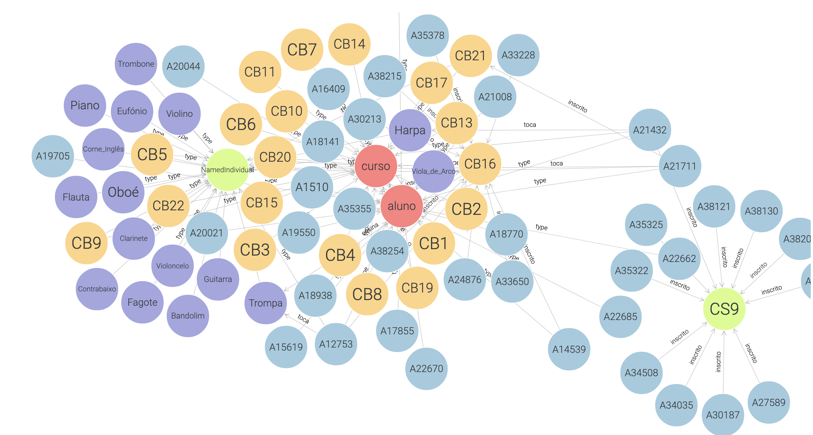

# TP2  - Conversão de JSON para TTL - Escola de música
__Data:__ 25/2/2024

__Autor:__ Francisca Barros

__UC:__ RPCW

---

O objetivo deste trabalho era transformar o ficheiro musica.json, fornecido pelo professor, numa ontologia (no formato ttl) e posteriormente carregá-lo para o GraphDB.

Após uma análise do dataset,  destacam-se 3 tipos de entidades: aluno, curso e instrumento. Optei por criar uma classe para cada um deles.

A classe instrumento optei por manter apenas o nome do instrumento e remover o respetivo identificador, visto que o nome era suficiente para identificar o mesmo.

A classe curso tem  as seguintes *data properties*:
- id
- designacao
- duracao
  
  
E tem uma *object property*: ensina, que associa cursos a instrumentos.

Finalmente, a classe aluno tem as seguintes *data properties*: 
- id
- nome
- dataNasc
- anoCurso

E duas *object properties*: toca (aluno &rarr; instrumento) e inscrito (aluno &rarr; curso).

Depois de ter a ontologia criada, criei uma script para a povoar.

Finalmente, o resultado foi importado para o GraphDB, como é possível observar:

---

Lista de resultados: jsonToTTL.py, musica.ttl.

