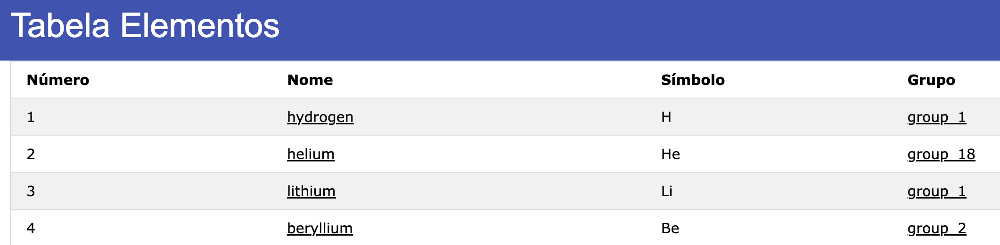
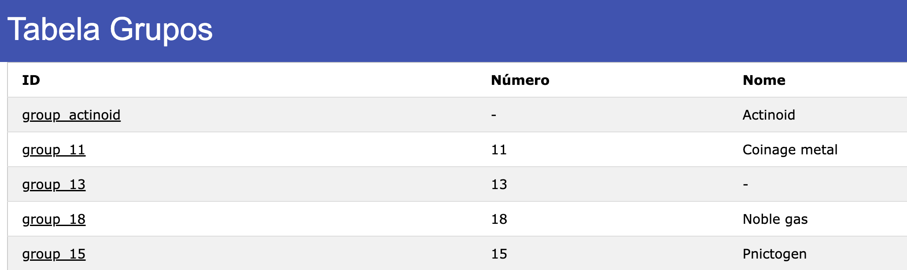
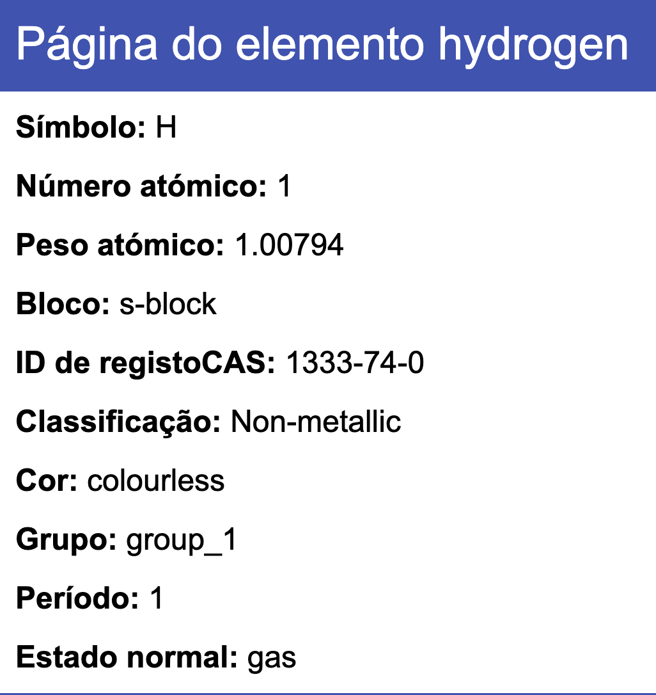
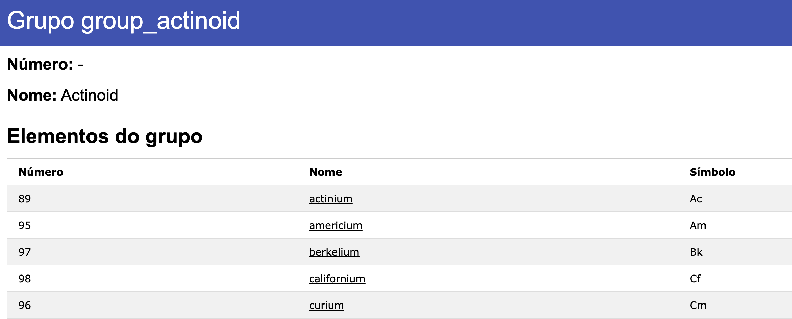

# TP4  - Aplicação da Tabela Periódica
__Data:__ 07/3/2024

__Autor:__ Francisca Barros

__UC:__ RPCW

---

Foi feita uma aplicação para mostrar a informação de uma ontologia da tabela periódica. Para tal, foram criadas 4 páginas distintas.

Uma página que mostra todos os elementos, com o seu número atómico, nome, símbolo e grupo. O nome tem um link para a página do respetivo elemento, bem como o grupo.

Uma página que mostra todos os grupos, com o seu número e o nome, cada grupo tem um link para a página do respetivo grupo.

A página do elemento, tem todas as informações relativas ao elemento especifico.

A página do grupo, tem todas as informações relativas ao grupo especifico: nome, número e os respetivos elementos.

---

Lista de resultados: app.py, pasta templates e static.

